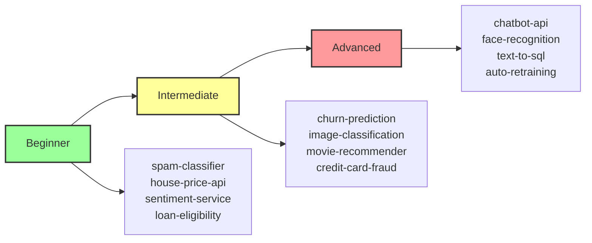
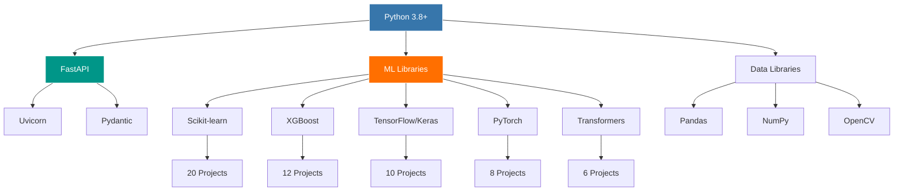
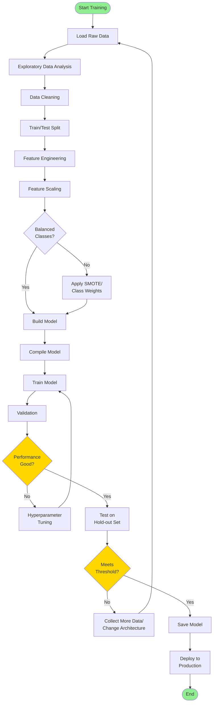
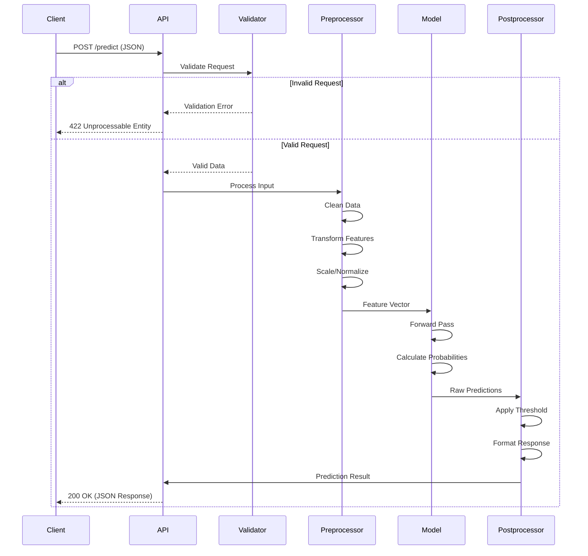
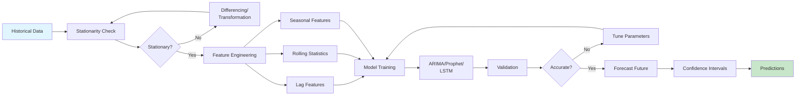
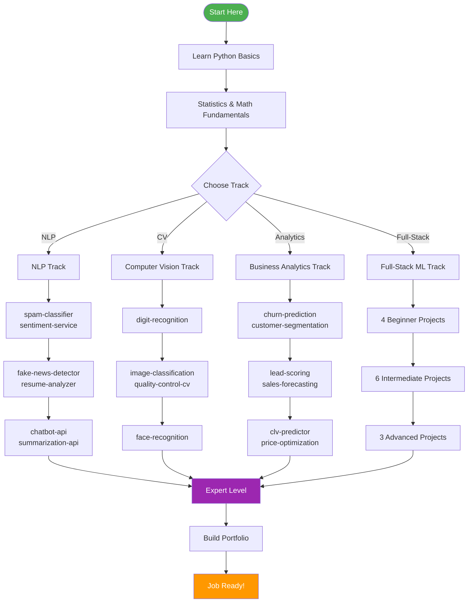
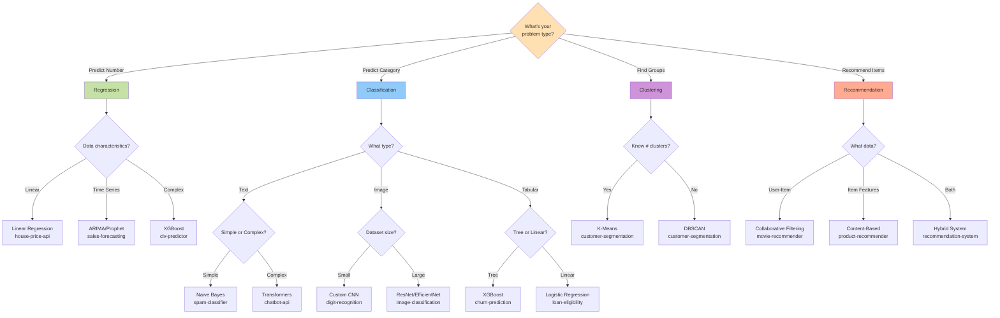

# 📊 Visual Diagrams Guide - AI/ML Projects

This document contains visual diagrams for understanding the architecture, data flow, and relationships across all AI/ML projects. These diagrams can be rendered using Mermaid or viewed as ASCII art.

## Table of Contents
1. [Project Relationship Diagrams](#project-relationship-diagrams)
2. [Architecture Diagrams](#architecture-diagrams)
3. [Data Flow Diagrams](#data-flow-diagrams)
4. [Learning Path Diagrams](#learning-path-diagrams)
5. [Technology Stack Diagrams](#technology-stack-diagrams)

---

## Project Relationship Diagrams

### Project Classification by Domain (Mermaid)

```mermaid
graph TB
    Root[AI/ML Projects - 36 Total]
    
    Root --> NLP[NLP Projects - 8]
    Root --> CV[Computer Vision - 5]
    Root --> Pred[Predictive Analytics - 11]
    Root --> Rec[Recommendation Systems - 4]
    Root --> Opt[Optimization - 3]
    Root --> Speech[Speech Processing - 1]
    Root --> MLOps[MLOps - 1]
    Root --> Other[Other - 3]
    
    NLP --> NLP1[spam-classifier]
    NLP --> NLP2[sentiment-service]
    NLP --> NLP3[fake-news-detector]
    NLP --> NLP4[resume-analyzer]
    NLP --> NLP5[chatbot-api]
    NLP --> NLP6[summarization-api]
    NLP --> NLP7[text-to-sql]
    NLP --> NLP8[news-aggregator]
    
    CV --> CV1[digit-recognition]
    CV --> CV2[image-classification]
    CV --> CV3[face-recognition]
    CV --> CV4[quality-control-cv]
    CV --> CV5[image-classification-products]
    
    Pred --> P1[house-price-api]
    Pred --> P2[churn-prediction]
    Pred --> P3[credit-card-fraud]
    Pred --> P4[lead-scoring]
    Pred --> P5[sales-forecasting]
    Pred --> P6[loan-eligibility]
    Pred --> P7[stock-price-classifier]
    Pred --> P8[predictive-maintenance]
    Pred --> P9[clv-predictor]
    Pred --> P10[demand-forecasting-neural]
    Pred --> P11[energy-consumption-forecasting]
    
    Rec --> R1[movie-recommender]
    Rec --> R2[product-recommender]
    Rec --> R3[recommendation-system-collaborative]
    Rec --> R4[market-basket-analysis]
    
    Opt --> O1[price-optimization-engine]
    Opt --> O2[supply-chain-optimization]
    Opt --> O3[inventory-optimization]
    
    Speech --> S1[speech-to-text]
    
    MLOps --> M1[auto-retraining]
    
    Other --> OT1[customer-segmentation]
    Other --> OT2[product-demand-forecasting]
    Other --> OT3[Math]
    
    style Root fill:#f9f,stroke:#333,stroke-width:4px
    style NLP fill:#bbf,stroke:#333,stroke-width:2px
    style CV fill:#bfb,stroke:#333,stroke-width:2px
    style Pred fill:#fbb,stroke:#333,stroke-width:2px
    style Rec fill:#fbf,stroke:#333,stroke-width:2px
```



### Learning Difficulty Progression (Mermaid)



### Technology Dependency Graph (Mermaid)



---

## Architecture Diagrams

### Standard Microservice Architecture (ASCII)

```
┌─────────────────────────────────────────────────────────────────┐
│                         CLIENT LAYER                             │
│   ┌─────────────┐  ┌─────────────┐  ┌─────────────┐           │
│   │  Web App    │  │  Mobile App │  │  Other APIs │           │
│   └──────┬──────┘  └──────┬──────┘  └──────┬──────┘           │
└──────────┼─────────────────┼────────────────┼──────────────────┘
           │                 │                │
           └─────────────────┼────────────────┘
                             │
                    HTTP/HTTPS REST API
                             │
┌────────────────────────────▼─────────────────────────────────────┐
│                      API GATEWAY (Optional)                       │
│  ┌────────────────────────────────────────────────────────────┐  │
│  │  - Load Balancing                                          │  │
│  │  - Rate Limiting                                           │  │
│  │  - Authentication                                          │  │
│  │  - Request Routing                                         │  │
│  └────────────────────────────────────────────────────────────┘  │
└────────────────────────────┬─────────────────────────────────────┘
                             │
┌────────────────────────────▼─────────────────────────────────────┐
│                      FASTAPI APPLICATION                          │
│  ┌────────────────────────────────────────────────────────────┐  │
│  │                    Endpoint Layer                          │  │
│  │  ┌──────────┐  ┌──────────┐  ┌──────────┐  ┌──────────┐  │  │
│  │  │   GET    │  │  POST    │  │  POST    │  │   GET    │  │  │
│  │  │    /     │  │ /predict │  │ /predict │  │  /model  │  │  │
│  │  │          │  │          │  │  /batch  │  │  /info   │  │  │
│  │  └──────────┘  └──────────┘  └──────────┘  └──────────┘  │  │
│  └─────────────────────────┬────────────────────────────────────┘  │
│                            │                                       │
│  ┌─────────────────────────▼────────────────────────────────────┐ │
│  │              Validation Layer (Pydantic)                     │ │
│  │  - Type checking                                             │ │
│  │  - Data validation                                           │ │
│  │  - Schema enforcement                                        │ │
│  └─────────────────────────┬────────────────────────────────────┘ │
│                            │                                       │
│  ┌─────────────────────────▼────────────────────────────────────┐ │
│  │              Business Logic Layer                            │ │
│  │  - Input preprocessing                                       │ │
│  │  - Feature engineering                                       │ │
│  │  - Model inference                                           │ │
│  │  - Post-processing                                           │ │
│  └─────────────────────────┬────────────────────────────────────┘ │
│                            │                                       │
│  ┌─────────────────────────▼────────────────────────────────────┐ │
│  │              ML Model Layer                                  │ │
│  │  ┌────────────────┐  ┌────────────────┐                     │ │
│  │  │  Trained Model │  │  Preprocessors │                     │ │
│  │  │  (In Memory)   │  │  (Scalers, etc)│                     │ │
│  │  └────────────────┘  └────────────────┘                     │ │
│  └──────────────────────────────────────────────────────────────┘ │
└───────────────────────────┬──────────────────────────────────────┘
                            │
                            │ Load/Save
                            │
┌───────────────────────────▼──────────────────────────────────────┐
│                    PERSISTENT STORAGE                             │
│  ┌──────────────┐  ┌──────────────┐  ┌──────────────┐          │
│  │ Model Files  │  │ Training Data│  │     Logs     │          │
│  │ (.pkl, .h5)  │  │ (CSV, DB)    │  │  (app.log)   │          │
│  └──────────────┘  └──────────────┘  └──────────────┘          │
└──────────────────────────────────────────────────────────────────┘
```

### ML Training Pipeline (Mermaid)



### Prediction Pipeline (Mermaid)



---

## Data Flow Diagrams

### NLP Text Processing Flow (ASCII)

```
┌──────────────────┐
│   Raw Text       │
│  "Free money!!!" │
└────────┬─────────┘
         │
         ▼
┌──────────────────┐
│  Lowercase       │
│  "free money!!!" │
└────────┬─────────┘
         │
         ▼
┌──────────────────┐
│  Remove Punct    │
│  "free money"    │
└────────┬─────────┘
         │
         ▼
┌──────────────────┐
│  Tokenization    │
│  ["free","money"]│
└────────┬─────────┘
         │
         ▼
┌──────────────────┐
│  Remove Stopwords│
│  ["free","money"]│
└────────┬─────────┘
         │
         ▼
┌──────────────────┐
│  Stemming/Lemma  │
│  ["free","money"]│
└────────┬─────────┘
         │
         ▼
┌──────────────────┐
│  Vectorization   │
│  TF-IDF/Embeddings│
│  [0.7, 0.9, ...]│
└────────┬─────────┘
         │
         ▼
┌──────────────────┐
│  ML Model        │
│  Classification  │
└────────┬─────────┘
         │
         ▼
┌──────────────────┐
│  Prediction      │
│  "SPAM" (95%)    │
└──────────────────┘
```

### Computer Vision Processing Flow (ASCII)

```
┌──────────────────┐
│  Input Image     │
│  (Any Size/Format)│
└────────┬─────────┘
         │
         ▼
┌──────────────────┐
│  Decode          │
│  Base64 → Binary │
└────────┬─────────┘
         │
         ▼
┌──────────────────┐
│  Load Image      │
│  PIL/OpenCV      │
└────────┬─────────┘
         │
         ▼
┌──────────────────┐
│  Resize          │
│  → (224,224,3)   │
└────────┬─────────┘
         │
         ▼
┌──────────────────┐
│  Normalize       │
│  [0,255] → [0,1] │
└────────┬─────────┘
         │
         ▼
┌──────────────────┐
│  Add Batch Dim   │
│  (H,W,C) → (1,H,W,C)│
└────────┬─────────┘
         │
         ▼
┌──────────────────┐
│  CNN Forward     │
│  Conv→Pool→Dense │
└────────┬─────────┘
         │
         ▼
┌──────────────────┐
│  Softmax         │
│  Class Probs     │
└────────┬─────────┘
         │
         ▼
┌──────────────────┐
│  Top-K Selection │
│  "cat" (92%)     │
│  "dog" (5%)      │
└──────────────────┘
```

### Time Series Forecasting Flow (Mermaid)



---

## Learning Path Diagrams

### Complete Learning Journey (Mermaid)



### Project Prerequisites Map (ASCII)

```
LEVEL 1: Prerequisites
├── Python Programming
├── Basic Statistics
├── Linear Algebra Basics
└── Command Line Usage

↓

LEVEL 2: Beginner Projects (Build Foundation)
├── spam-classifier ────────► Learn: Classification, NLP basics
├── house-price-api ────────► Learn: Regression, feature engineering
├── loan-eligibility ───────► Learn: Binary classification
└── sentiment-service ──────► Learn: Pre-trained models

↓

LEVEL 3: Intermediate Projects (Core Skills)
├── churn-prediction ───────► Requires: Classification basics
│   └── Learn: XGBoost, SHAP, imbalanced data
│
├── image-classification ───► Requires: Neural network basics
│   └── Learn: CNNs, transfer learning
│
├── movie-recommender ──────► Requires: Linear algebra
│   └── Learn: Collaborative filtering, matrix factorization
│
└── credit-card-fraud ──────► Requires: Classification
    └── Learn: Anomaly detection, precision-recall tradeoff

↓

LEVEL 4: Advanced Projects (Specialization)
├── chatbot-api ────────────► Requires: NLP intermediate
│   └── Learn: Transformers, BERT, GPT, dialogue
│
├── face-recognition ───────► Requires: CV intermediate
│   └── Learn: Siamese networks, embeddings
│
└── auto-retraining ────────► Requires: Multiple ML projects
    └── Learn: MLOps, monitoring, automation

↓

LEVEL 5: Expert (Production Systems)
└── Build complex, multi-model systems
```

---

## Technology Stack Diagrams

### Complete Technology Ecosystem (ASCII)

```
                    ┌─────────────────────────────────┐
                    │     CLIENT APPLICATIONS         │
                    │  Web • Mobile • Desktop • CLI   │
                    └────────────┬────────────────────┘
                                 │
                    ┌────────────▼────────────────────┐
                    │      API LAYER                  │
                    │  ┌──────────┐  ┌─────────────┐ │
                    │  │ FastAPI  │  │  Uvicorn    │ │
                    │  └──────────┘  └─────────────┘ │
                    │  ┌──────────┐  ┌─────────────┐ │
                    │  │ Pydantic │  │  CORS       │ │
                    │  └──────────┘  └─────────────┘ │
                    └────────────┬────────────────────┘
                                 │
        ┌────────────────────────┼────────────────────────┐
        │                        │                        │
┌───────▼─────────┐    ┌────────▼────────┐    ┌─────────▼────────┐
│  CLASSICAL ML   │    │  DEEP LEARNING  │    │  SPECIALIZED     │
│                 │    │                 │    │                  │
│ ┌─────────────┐ │    │ ┌─────────────┐ │    │ ┌──────────────┐│
│ │Scikit-learn │ │    │ │ TensorFlow  │ │    │ │ SHAP         ││
│ └─────────────┘ │    │ └─────────────┘ │    │ └──────────────┘│
│ ┌─────────────┐ │    │ ┌─────────────┐ │    │ ┌──────────────┐│
│ │  XGBoost    │ │    │ │  PyTorch    │ │    │ │ Prophet      ││
│ └─────────────┘ │    │ └─────────────┘ │    │ └──────────────┘│
│ ┌─────────────┐ │    │ ┌─────────────┐ │    │ ┌──────────────┐│
│ │  LightGBM   │ │    │ │Transformers │ │    │ │ OpenCV       ││
│ └─────────────┘ │    │ └─────────────┘ │    │ └──────────────┘│
└─────────────────┘    └─────────────────┘    └──────────────────┘
        │                        │                        │
        └────────────────────────┼────────────────────────┘
                                 │
                    ┌────────────▼────────────────────┐
                    │      DATA LAYER                 │
                    │  ┌──────────┐  ┌─────────────┐ │
                    │  │  Pandas  │  │   NumPy     │ │
                    │  └──────────┘  └─────────────┘ │
                    │  ┌──────────┐  ┌─────────────┐ │
                    │  │  Pillow  │  │  Datasets   │ │
                    │  └──────────┘  └─────────────┘ │
                    └────────────┬────────────────────┘
                                 │
                    ┌────────────▼────────────────────┐
                    │    STORAGE & DEPLOYMENT         │
                    │  ┌──────────┐  ┌─────────────┐ │
                    │  │  Docker  │  │ Kubernetes  │ │
                    │  └──────────┘  └─────────────┘ │
                    │  ┌──────────┐  ┌─────────────┐ │
                    │  │   S3     │  │  Postgres   │ │
                    │  └──────────┘  └─────────────┘ │
                    └─────────────────────────────────┘
```

### ML Algorithm Selection Tree (Mermaid)



### Deployment Architecture Options (ASCII)

```
OPTION 1: Single Container (Beginner Projects)
┌────────────────────────────────────────┐
│          Docker Container              │
│  ┌──────────────────────────────────┐  │
│  │   FastAPI App + ML Model         │  │
│  │   Port: 8000                     │  │
│  └──────────────────────────────────┘  │
└────────────────┬───────────────────────┘
                 │
        Exposed Port 8000


OPTION 2: Multi-Container (Intermediate)
┌────────────────────────────────────────┐
│       Docker Compose                   │
│                                        │
│  ┌──────────────┐  ┌───────────────┐  │
│  │  API Server  │  │  Redis Cache  │  │
│  │  Port: 8000  │  │  Port: 6379   │  │
│  └──────┬───────┘  └───────┬───────┘  │
│         └────────┬──────────┘          │
│                  │                     │
│         ┌────────▼────────┐            │
│         │   Shared Vol    │            │
│         │   (Models)      │            │
│         └─────────────────┘            │
└────────────────────────────────────────┘


OPTION 3: Kubernetes (Production)
┌────────────────────────────────────────────────┐
│             Kubernetes Cluster                 │
│                                                │
│  ┌──────────────────────────────────────────┐ │
│  │         Ingress Controller               │ │
│  │  (Load Balancer + SSL Termination)       │ │
│  └──────────────┬───────────────────────────┘ │
│                 │                              │
│  ┌──────────────▼───────────────────────────┐ │
│  │            Service                       │ │
│  │      (Internal Load Balancer)            │ │
│  └──────────────┬───────────────────────────┘ │
│                 │                              │
│     ┌───────────┼───────────┐                 │
│     │           │           │                 │
│  ┌──▼───┐   ┌──▼───┐   ┌──▼───┐              │
│  │ Pod  │   │ Pod  │   │ Pod  │              │
│  │API+ML│   │API+ML│   │API+ML│              │
│  └──────┘   └──────┘   └──────┘              │
│                                                │
│  ┌──────────────────────────────────────────┐ │
│  │        Persistent Volume                 │ │
│  │      (Shared Model Storage)              │ │
│  └──────────────────────────────────────────┘ │
└────────────────────────────────────────────────┘
```

---

## Model Performance Comparison

### Accuracy vs Speed Tradeoff (ASCII Graph)

```
High Accuracy
    │
100%│                                    ● Transformers (chatbot)
    │                              ● ResNet (face-recognition)
 95%│                        ● XGBoost (churn-prediction)
    │                  ● Random Forest (credit-fraud)
 90%│            ● CNN (image-classification)
    │      ● SVM (loan-eligibility)
 85%│ ● Naive Bayes (spam-classifier)
    │
 80%│
    └─────────────────────────────────────────────────────►
      Fast                                            Slow
      <50ms        100ms         200ms         500ms   >1s